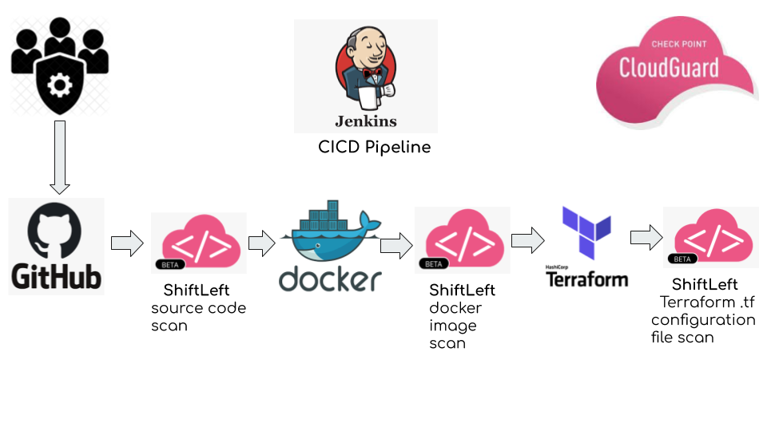
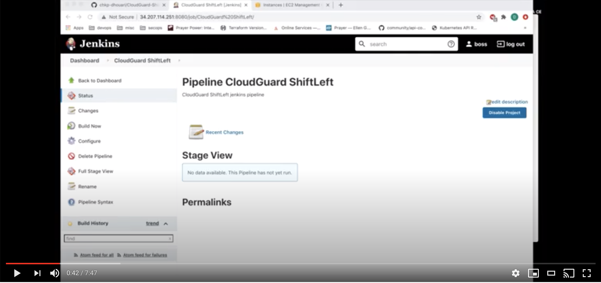

# Check Point CloudGuard ShiftLeft integration with Jenkins CICD pipeline:

##  This demo contains Malware so please do not use in a production environment and Handle with Care


CloudGuard ShiftLeft CLI tool is a framework that will enable you to access all the various blades that CloudGuard offers quick and easy for integration within your pipeline.
CloudGuard ShiftLeft will allow you to scan source code, Docker container images and serverless deployment packages, Terraform templates, and more. 
The ShiftLeft binary or Docker container will integrate posture management and SAST to your CI/CD deployment pipelines for any CI server.

The ShiftLeft Binary can be installed on Windows, Linux or MacOS.

The ShiftLeft container is available on Docker Hub:
https://hub.docker.com/r/checkpoint/shiftleft

> docker pull checkpoint/shiftleft

Shiftleft SAST and static code analysis for code and container images will scan for CVEs, CWEs, Malware and credentials by leveraging Check Point ThreatCloud which is a collaborative network and cloud-driven knowledge base that delivers real-time dynamic security intelligence


## The following blades are currently available for use within the framework:
                                                                                       
### Git code-scan	      

The code-scan blade provides Source-code security and visibility into the risk analysis of projects in Git repositories.

> shiftleft code-scan 

### iac-assessment	

The iac-assessment blade will scan Infrastructure-as-code templates, enabling DevOps and security teams to identify insecure configurations	

> shiftleft iac-assessment 

### image-scan	   

The image-scan blade will scan Docker container images for security risks and vulnerabilities

> shiftleft image-scan 


 

[](https://www.youtube.com/watch?v=UAZixZ7ddbQ&feature=youtu.be "ShiftLeft")


#### Please add your Cloudguard credentials and add them to Jenkins using CHKP_CLOUDGUARD_ID and CHKP_CLOUDGUARD_SECRET

### The scan result for the source code scan:

> ShiftLeft is capable of finding CVEs, credentials and Malware!


```

+ ./shiftleft code-scan -s .
SourceGuard Scan Started!                    
Project name: webdemo path: .                
Scan ID: 91f51a48c254e8437d5fc2451c08b8b563c81ef8e8cc8932f4c8db81038c494a-nc7muW 
Scanning ...                                 
Analyzing ...                                
Action: BLOCK
...
File Reputation Findings:
	- Name: "Backdoor.Win32.Evilbot.a.W.dsdyg"
	  Classification:  "Malware"
	  Verdict:  "MALICIOUS"
		- SHA: adbf428cc50dfca03a30f9050ea648649bae81be75f0db35c7158c2672c7e883 Path: terraform pipeline/web.rar
	- Name: "Trojan.Win32.Generic.W.sbmrl"
	  Classification:  "Malware"
	  Verdict:  "MALICIOUS"
		- SHA: 9fe7290683da9970955808375b203340812ada3a63930bc2db88ecb956842d0f Path: terraform pipeline/myshell.rar

```

### The docker image scan result:

> The scan also finds the Malware in the layers as well as all the CVEs from the official Node container image from Docker Hub

```

+ ./shiftleft image-scan -t 180 -i webapp.tar
INFO   [06-10-2020 03:33:44.430] SourceGuard Scan Started!                    
INFO   [06-10-2020 03:33:45.203] Project name: webapp path: /tmp/SourceGuard504451456 
INFO   [06-10-2020 03:33:45.203] Scan ID: 5c21bf9480c74cad83f63626860798cc4c7d019c224d21d55c96894314a158a4-f1qBm8 
Action: BLOCK
Code Findings:
	- ID: 20000000-0000-0000-0000-000000000007
	  Name: "shelltrue"
	  Description: "Shell=True can lead to dangerous shell escapes"
		- SHA: a2b75fa17e7a052690e75c9fd0e6d9845ca69140e13e630e819234fa2a432346 Path: /tmp/usr/share/dh-python/dhpython/pydist.py
			- SHA: 4160343dcb25b21722d0764e217d2ad145e0b409ba75d6a33f95127a5f037bcd
			  Payload: shell=True
			  Lines: [199]
		- SHA: 1e1ce44bbcfef8f0016d66904ad3f4b6fabec758d1b608bad145635f4ac81d6b Path: /tmp/usr/bin/py3compile
			- SHA: 4160343dcb25b21722d0764e217d2ad145e0b409ba75d6a33f95127a5f037bcd
			  Payload: shell=True
			  Lines: [132]
		- SHA: 35051ef3a01cb74d2bdc224459be5b9968b1ef27da86dd3a68800633abb07822 Path: /tmp/usr/share/dh-python/dhpython/_defaults.py
			- SHA: 4160343dcb25b21722d0764e217d2ad145e0b409ba75d6a33f95127a5f037bcd
			  Payload: shell=True
			  Lines: [71]
		- SHA: 258e0b185edd2c61b47e20445c602424c7b9eb1b6f3d56b08725f6baef0c313d Path: /tmp/usr/share/dh-python/dhpython/tools.py
			- SHA: 4160343dcb25b21722d0764e217d2ad145e0b409ba75d6a33f95127a5f037bcd
			  Payload: shell=True
			  Lines: [123 192]
File Reputation Findings:
	- Name: "Backdoor.Win32.Evilbot.a.W.dsdyg"
	  Classification:  "Malware"
	  Verdict:  "MALICIOUS"
		- SHA: adbf428cc50dfca03a30f9050ea648649bae81be75f0db35c7158c2672c7e883 Path: /tmp/home/web.rar
	- Name: "Trojan.Win32.Generic.W.sbmrl"
	  Classification:  "Malware"
	  Verdict:  "MALICIOUS"
		- SHA: 9fe7290683da9970955808375b203340812ada3a63930bc2db88ecb956842d0f Path: /tmp/home/myshell.rar
Packages Findings:
	- Package Path: /usr/local/lib/node_modules/npm/node_modules/psl/yarn.lock
	  Package Manager: yarn
	  Severity: CRITICAL
		- lodash  4.17.10
		  Severity: CRITICAL
		  Line: 2654
		  CVEs Findings:
			- ID: CVE-2019-10744
			Description: Versions of lodash lower than 4.17.12 are vulnerable to Prototype Pollution. The function defaultsDeep could be tricked into adding or modifying properties of Object.prototype using a constructor payload.
			Severity: CRITICAL
			Last Modified: 2019-10-04T09:15:00Z
			- ID: CVE-2020-8203
			Description: Prototype pollution attack when using _.zipObjectDeep in lodash <= 4.17.15.
			Severity: HIGH
			Last Modified: 2020-08-17T16:49:00Z
			- ID: CVE-2019-1010266
			Description: lodash prior to 4.17.11 is affected by: CWE-400: Uncontrolled Resource Consumption. The impact is: Denial of service. The component is: Date handler. The attack vector is: Attacker provides very long strings, which the library attempts to match using a regular expression. The fixed version is: 4.17.11.
			Severity: MEDIUM
			Last Modified: 2020-09-30T13:40:00Z
			- ID: CVE-2018-16487
			Description: A prototype pollution vulnerability was found in lodash <4.17.11 where the functions merge, mergeWith, and defaultsDeep can be tricked into adding or modifying properties of Object.prototype.
			Severity: MEDIUM
			Last Modified: 2020-09-18T16:38:00Z
		- axios  0.15.3
		  Severity: HIGH
		  Line: 293
		  CVEs Findings:
			- ID: CVE-2019-10742
			Description: Axios up to and including 0.18.0 allows attackers to cause a denial of service (application crash) by continuing to accepting content after maxContentLength is exceeded.
			Severity: HIGH
			Last Modified: 2019-05-08T16:04:00Z
		- ftp  0.3.10
		  Severity: UNKNOWN
		  Line: 1728
		  CVEs Findings:
			- ID: CVE-1999-0201
			Description: A quote cwd command on FTP servers can reveal the full path of the home directory of t
			
			
....

```
### The Terraform scan result:

The Terraform main.tf has a configuration to deploy a S3 bucket and I am using a CloudGuard GSL rule to check for S3 server side encryption:

```

+ ./shiftleft iac-assessment -l "S3Bucket should have encryption.serverSideEncryptionRules" -p ./terraform
ERROR  [06-10-2020 03:36:07.870] test rule name: '' logic: S3Bucket failed with error 
[
    {
        "error": "Syntax failure: <line:1,col:8> found '<EOF>' expecting 'should'",
        "testedCount": 0,
        "relevantCount": 0,
        "nonComplyingCount": -1,
        "exclusionStats": {
            "testedCount": 0,
            "relevantCount": 0,
            "nonComplyingCount": 0
        },
        "entityResults": [],
        "rule": {
            "name": "",
            "severity": "Low",
            "logic": "S3Bucket",
            "description": "",
            "remediation": "",
            "complianceTag": "",
            "domain": "",
            "priority": "",
            "controlTitle": "",
            "ruleId": "",
            "logicHash": "rFr9vjbTWZrisy/p45rlqw",
            "isDefault": false
        },
        "testPassed": false
    }
]
[Pipeline] }
[Pipeline] // stage
[Pipeline] }
[Pipeline] // withCredentials
[Pipeline] }
[Pipeline] // withEnv
[Pipeline] }
[Pipeline] // node
[Pipeline] End of Pipeline
ERROR: script returned exit code 1
Finished: FAILURE

```
